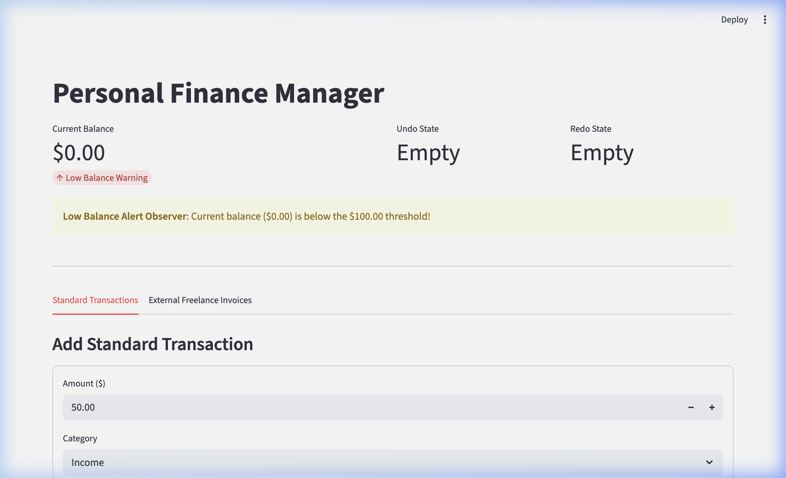

In this project, I built a Personal Finance Manager using four design patterns: Singleton, Adapter, Observer, and Command. 

Singleton helped centralize coordination by allowing any transaction from anywhere in the codebase to update a single ledger. It also includes an internal sentinel that forbids direct instantiation and enforces get_instance(). Trade off: A singleton pattern introduces global mutable state. This was resolved by invoking reset(clear_observers=True) in setUp() and tearDown() to guarantee a perfect, clean state before and after every unit test.

Adapter makes sure that classes like Balance and Transaction are closed and cannot be modified. This helps improve separation of concerns and type safety. Trade off: Some rich metadata like invoice_id, client name, and project description is lost as Transaction only stores amount and category.

Observer creates loose coupling so that Balance has zero knowledge of observer implementations and only iterates over its subscriber list. Trade off: If an observer raises an unhnandled exception in update() it risks interrupting the balance calculation and subsequent observers.

Finally, Command helps implement reversibility and keep a linear timeline of transactions. Trade off: Long history stacks can cause memory bloat and this was addressed by introducing a max_history variable . 



## Getting Started

### Dependencies

Make sure you have python version >= 3.10.x installed on your computer. 


### Installation

1. Clone the repo:

```
bash
git clone https://github.com/udacity/cd14600-project-starter.git
cd cd14600-project-starter/starter
```

2. Run the Program: 
```
python main.py
```

## Testing

This project uses Python’s built-in unittest framework.

To run all tests:

```
python -m unittest discover
```

To run a single test file:
```
python -m unittest balance/test_balance_observer.py
```

### Break Down Tests

- test_balance.py → Verifies correct implementation of the Singleton Balance class.
- test_transaction.py → Confirms transactions update balances correctly.
- test_transaction_adapter.py → Ensures external income data is correctly adapted into Transaction objects.
- test_balance_observer.py → Validates that low-balance alerts are triggered at the correct threshold.

### Running the web application
```bash
cd main/main
streamlit run app.py
```


## Built With

* [Python](https://www.python.org/) – Main programming language
* [unittest](https://docs.python.org/3/library/unittest.html) – Testing framework
* [PEP8](https://peps.python.org/pep-0008/) – Style guide for Python code

## License

[License](LICENSE.txt)
